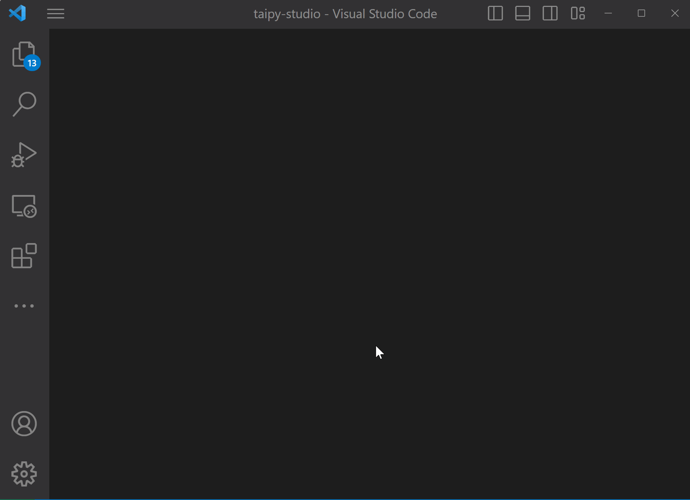

# Taipy Studio

[Taipy Studio](https://marketplace.visualstudio.com/items?itemName=Taipy.taipy-studio)
provides a set of tools that accelerate the creation of [Taipy](https://www.taipy.io/)
applications, reducing the code that needs to be manually written.

Taipy Studio is an extension to [Visual Studio Code](https://code.visualstudio.com/), which
provides a whole development environment, including state-of-the-art support for the Python
programming language.

## Extensions included

Taipy Studio automatically installs two extensions:

* [Taipy Studio Configuration Builder](https://marketplace.visualstudio.com/items?itemName=Taipy.studio-config) -
  Provides a point-and-click edition environment to create and modify Taipy configuration
  files.
* [Taipy Studio GUI Helper](https://marketplace.visualstudio.com/items?itemName=Taipy.studio-gui) -
  Provides support for the extended Markdown syntax used in Taipy GUI. This includes IntelliSense on
  visual element properties, code navigation, variable explorer, and more. 
  **Taipy API Support: 2.0+**

## Quick start

  1. Install [Taipy](https://pypi.org/project/taipy/) version 2.0 or above on your system.
  1. Install the [Taipy Studio](https://marketplace.visualstudio.com/items?itemName=Taipy.taipy-studio)
     extension. 
     You can look at the [Extension Marketplace](https://code.visualstudio.com/docs/editor/extension-marketplace)
     page on how to install the extension. Look for extensions whose names contain "Taipy".

You can now start building your Taipy application with specific tools that will
make your team and yourself far more productive!

## Moving forward

Taipy Studio can be used in two main scenarios:

- Building Taipy configuration files: 
  If you plan to build Taipy configuration files, you can open the "Taipy Configs" view
  and get started. This view opens in the *Secondary Side Bar".

  If your current project has any configuration files (`*.toml`), they are listed in
  the "Config Files" section at the top of this view. 
  You can then select a configuration file to work on, adding and editing the configuration
  items that your application can use. 
  See the complete documentation on
  [Building Taipy configuration files](https://docs.taipy.io/en/latest/manuals/studio/config/)
  for details.

- Creating Taipy GUI pages: 
  If you edit a Markdown source file (`*.md`) or a string in a Python source file (`*.py`),
  Taipy Studio will provide you with support for the Taipy GUI syntax. 
  See the complete documentation on
  [Creating Taipy GUI pages](https://docs.taipy.io/en/latest/manuals/studio/gui/) for details.
